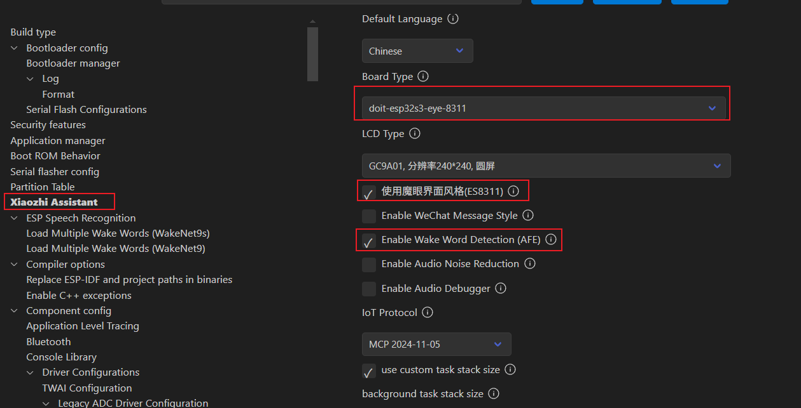
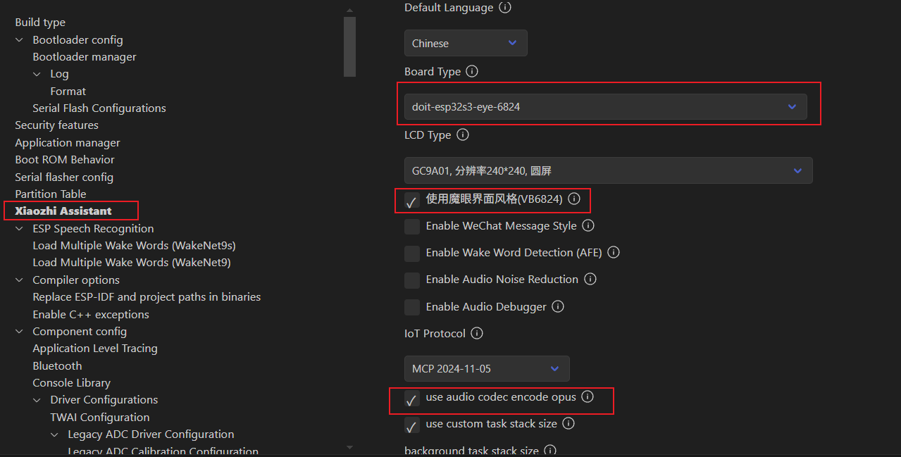
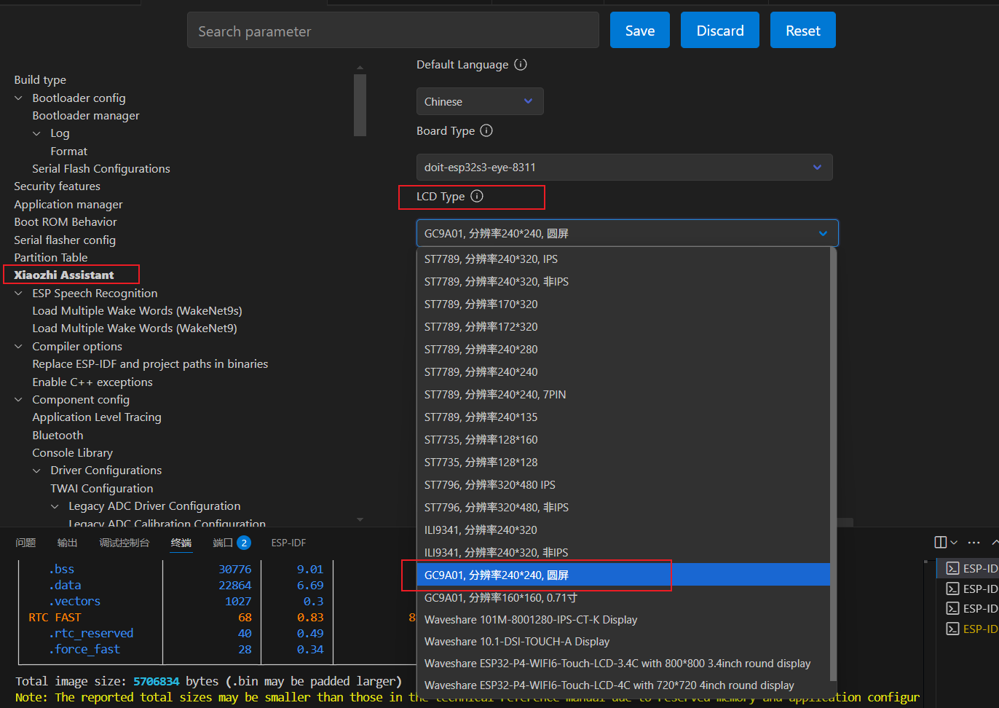
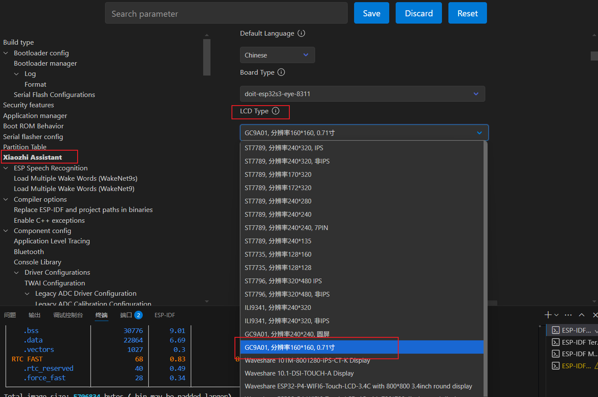

# RoPet_ESPS3_AI_EYE

*   首先致谢虾哥的开源项目：https://github.com/78/xiaozhi-esp32
*   其次致谢：https://github.com/xinnan-tech/xiaozhi-esp32-server

## 项目简介
ESP32-S3作为主控，驱动两个1.28寸双目，并且支持4个触目节点，软件硬件全开源

特色：

1. 可以接入小智的服务端，也可以接入自已部署的开源小智服务端。
2. 根据聊天的情绪互动双目的表情。
3. 带4个触摸，可以和双目互动。
4. 可以扩展加摄像头支持多模态。

## 效果视频
https://www.bilibili.com/video/BV1zcV2zLEEb/

https://www.bilibili.com/video/BV1BcV2zLEaf/

## 使用说明
1. 获取代码：git clone https://github.com/SmartArduino/RoPet_ESPS3_AI_EYE.git
2. 使用vscode打开工程（需espidf版本>5.4.1）,设置目标芯片为esp32s3，命令：idf.py set-target esp32s3
3. 修改menuconfig:idf.py menuconfig
    --板子类型选择（ES8311/VB6824）
        -ES8311:将Xiaozhi Assistant->Board Type设置为doit-esp32s3-eye,并开启使用魔眼界面风格(ES8311)
        
        -VB6824:将Xiaozhi Assistant->Board Type设置为doit-esp32s3-6824,并开启使用魔眼界面风格(VB6824)
        
    --屏幕类型选择（1.28/0.71）
        -1.28寸:将Xiaozhi Assistant->LCD_Type设置为【GC9A01，分辨率240*240，圆屏】
        
        -0.71寸：将Xiaozhi Assistant->LCD_Type设置为【GC9A01，分辨率160*160，0.71寸】
        
4. 编译工程：idf.py build
5. 烧录代码:idf.py flash

## 硬件部分
查看工程 docs目录

